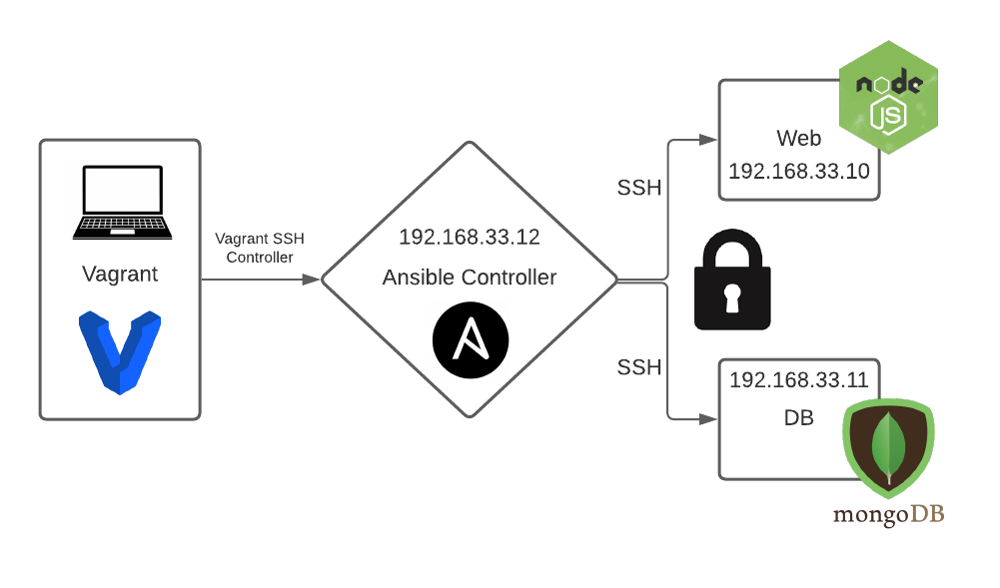

# Infrastructure as Code (IaC)

## IAC with Ansible
## Ansible benefits
* Automate provisioning of multiple servers without needing to access each server individually
* Saves costs and time

## Ansibe in DevOps
* Create a VM which can SSH into various servers in order to run provisioning


### Let's create Vagrantfile to create Three VMs for Ansible architecture
#### Ansible controller and Ansible agents 

```

# -*- mode: ruby -*-
 # vi: set ft=ruby :
 
 # All Vagrant configuration is done below. The "2" in Vagrant.configure
 # configures the configuration version (we support older styles for
 # backwards compatibility). Please don't change it unless you know what
 
 # MULTI SERVER/VMs environment 
 #
 Vagrant.configure("2") do |config|
 # creating are Ansible controller
   config.vm.define "controller" do |controller|
     
    controller.vm.box = "bento/ubuntu-18.04"
    
    controller.vm.hostname = 'controller'
    
    controller.vm.network :private_network, ip: "192.168.33.12"
    
    # config.hostsupdater.aliases = ["development.controller"] 
    
   end 
 # creating first VM called web  
   config.vm.define "web" do |web|
     
     web.vm.box = "bento/ubuntu-18.04"
    # downloading ubuntu 18.04 image
 
     web.vm.hostname = 'web'
     # assigning host name to the VM
     
     web.vm.network :private_network, ip: "192.168.33.10"
     #   assigning private IP
     
     #config.hostsupdater.aliases = ["development.web"]
     # creating a link called development.web so we can access web page with this link instread of an IP   
         
   end
   
 # creating second VM called db
   config.vm.define "db" do |db|
     
     db.vm.box = "bento/ubuntu-18.04"
     
     db.vm.hostname = 'db'
     
     db.vm.network :private_network, ip: "192.168.33.11"
     
     #config.hostsupdater.aliases = ["development.db"]     
   end
 
 
 end
```
## Setting up Ansible in Controller VM
* Created provisioning file to automate update and upgrade
* automate installation of ansible and dependencies

## Create Host file within Controller
* `cd /etc/ansible` 
* `rm -rf hosts`
* `sudo nano hosts`
* Ensure nodes are known_hosts within controller VM, achieved by pinging IP of each node.  
* Enter IP adresses of host nodes
* `sudo ansible web -m ping` & `sudo ansible db -m ping` will fail with just IP of each node but will add host IP to known_hosts file within `~/.ssh`
* Then add ansible ssh commands within the hosts file and run `sudo ansible all -m ping`
```
# add ip address/s of your agent nodes
[web]
192.168.33.10 ansible_connection=ssh ansible_ssh_user=vagrant ansible_ssh_pass=vagrant
[db]
192.168.33.11 ansible_connection=ssh ansible_ssh_user=vagrant ansible_ssh_pass=vagrant
```
* After typing `[web]` you can have multiple hosts under this heading in the case you have multiple app instances running, just add the IP and ansible ssh commands below heading and whenever you call a command from controller VM all web hosts will run said command.

## Carry out Adhic commands:
* Ping 
  -  `ansible all -m ping` - pings all VM listed in hosts file
  -  `ansible web -m ping`- pings web VM
  -  `ansible db -m ping` - pings db wm

* VM INFO
  - `ansible all -a "uname -a"` - give basic information for all VM listed in hosts file
  - `ansible web -a "uname -a"` - give basic information for db VM
  - `ansible db -a "uname -a"` - give basic information for db VM
  - `ansible all -a "<command>"` will run on all the VM in the hosts file
  - `ansible db -a "ls -a"` shows all files of each VM in the home dir

## Ansible Playbooks
* Create a yml file to install nginx
* `sudo nano install_nginx.yml`
* Once inside type the following:
```
# File to configure and install nginx in web agent node
---
# which host do we need to install nginx in 
- hosts: web
  gather_facts: true


# what facts do we want to see while installing


# do we need admin access? yes (sudo)
  become: true

# what task do we want to perform in this yml file 
  tasks:
  - name: Install Nginx in web Agent Node
    apt: pkg=nginx state=present
    become_user: root
```
* To run playbook type `sudo ansible-playbook install_nginx.yml`
* Check if it worked by typing `sudo ansible web -a "systemctl status nginx"`

* Create a playbook to install nodejs in web node
* copy app folder
* npm install then npm start
* end goal is to see node running in our browser with port 3000
